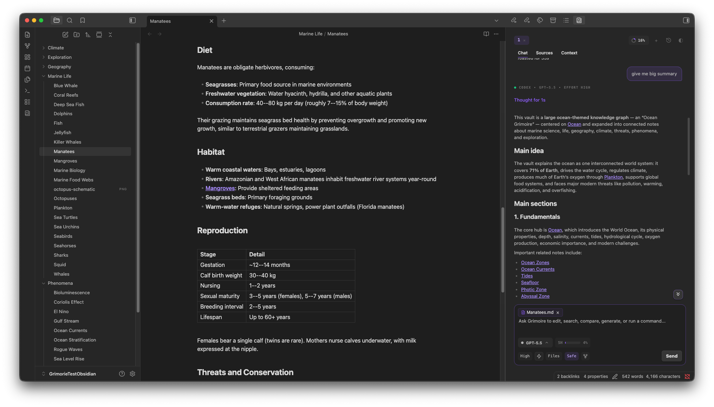
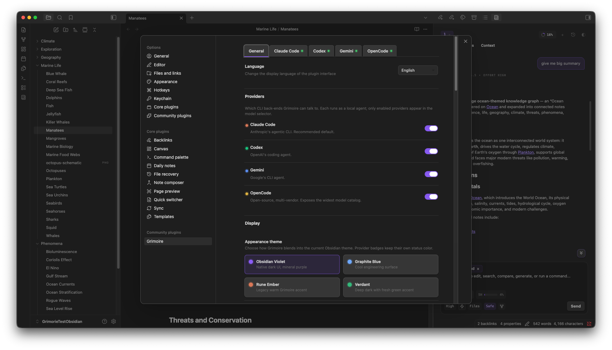
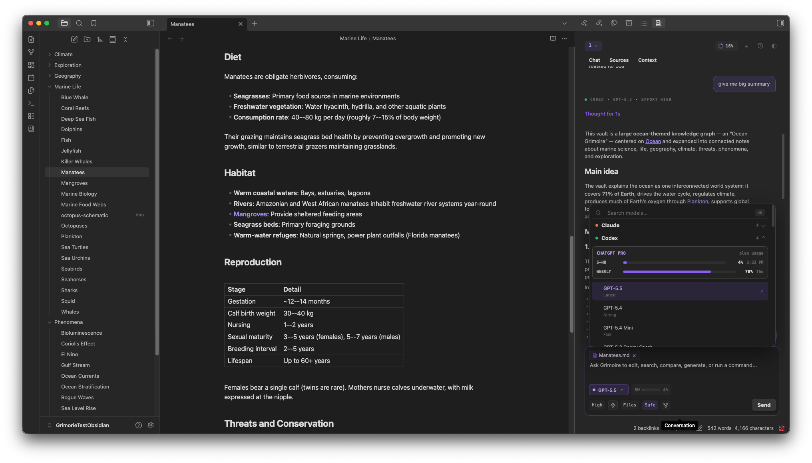

# Grimoire

<p align="center">
  
</p>

<p align="center">
  <strong>Obsidian vault のための local-first AI エージェント。</strong>
</p>

<p align="center">
  <a href="../../README.md">English</a> · <a href="README.zh-CN.md">简体中文</a> · <a href="README.zh-TW.md">繁體中文</a> · <a href="README.ja.md">日本語</a> · <a href="README.de.md">Deutsch</a> · <a href="README.fr.md">Français</a> · <a href="README.es.md">Español</a> · <a href="README.ru.md">Русский</a>
</p>

<p align="center">
  
  
  
  
</p>

<p align="center">
  
</p>

<p align="center">
  <sub>ノートがある同じ Obsidian workspace で、ローカル CLI エージェントと会話できます。</sub>
</p>

Grimoire は agentic CLI アシスタントを Obsidian に組み込みます。Claude Code、Codex、Antigravity CLI、Gemini CLI (Legacy)、OpenCode がひとつのサイドパネルに入り、ノートを読み、ファイルを編集し、コマンドを実行し、ツールを呼び出し、実際の vault に紐づいた session history を保持します。Grimoire のサーバーは介在しません。Telemetry も hosted backend も、あなたと provider の間に入る proxy もありません。

Grimoire は、すでに Obsidian で作業している人のために作られています。ローカル context、ローカル files、意図して選ぶ provider、そして UI 上で確認できる usage と cost を重視しています。

> 英語版 [README](../../README.md) がプロジェクトの canonical document です。この日本語版は `1.0.11` のドキュメントに同期しています。

## Grimoire を使う理由

- すでに信頼している CLI エージェントを、ノートの中で直接使えます。
- Composer から provider を切り替えられます。Claude Code、Codex、Antigravity CLI、Gemini CLI (Legacy)、OpenCode は同じ model picker を共有します。
- すべての turn を vault context に grounded できます。ノート、フォルダ、MCP tools を mention でき、手で path を貼る必要がありません。
- Model selector のすぐ横で cost と limits を確認できます。
- Local-first のまま使えます。Grimoire は telemetry を集めず、prompts を proxy せず、backend を実行しません。

## 各 provider ができること

| Capability | Claude Code | Codex | Antigravity CLI | Gemini CLI (Legacy) | OpenCode |
| --- | --- | --- | --- | --- | --- |
| Local persistent runtime | Yes | Yes | No | Yes | Yes |
| Native history hydration | Yes | Yes | No | Yes | Yes |
| Plan mode | Yes | Yes | No | Yes | Yes |
| Image attachments | Yes | Yes | No | Yes | Yes |
| Instruction mode | Yes | Yes | No | Yes | Yes |
| Reasoning effort controls | Yes | Yes | Yes | Yes | Yes |
| Rewind | Yes | No | No | No | No |
| Fork | Yes | Yes | No | No | No |
| Provider slash commands | Yes | No | No | No | Yes |
| Grimoire-managed MCP UI | Yes | No | No | No | No |

## インストール

Grimoire は desktop plugin です。Provider CLIs をローカルで実行するため、mobile build はありません。

### BRAT でインストール

BRAT は GitHub Releases から Grimoire をインストールし、tagged builds に追従できます。

1. "Obsidian42 - BRAT" plugin をインストールします。
2. BRAT で `sandsaber/Grimoire` から beta plugin を追加します。
3. Grimoire を有効化します。

### GitHub Releases からインストール

BRAT を使わない場合は、現在の release を手動でインストールできます。

1. 最新の [Grimoire release](https://github.com/sandsaber/Grimoire/releases/latest) から `main.js`、`manifest.json`、`styles.css` をダウンロードします。
2. `/path/to/your/vault/.obsidian/plugins/grimoire` を作成します。
3. 3 つのファイルをそのフォルダに入れます。
4. Settings, Community plugins から Grimoire を有効化します。

### Community plugins からインストール（準備中）

Grimoire が Obsidian community plugin directory に掲載されたら、次の手順でインストールできます。

1. Settings を開き、Community plugins に移動し、必要なら Restricted mode をオフにします。
2. Browse をクリックし、Grimoire を検索してインストールします。
3. Grimoire を有効化し、ribbon または command palette からパネルを開きます。

### ソースからインストール

Release bundle を build して vault に配置します。

```bash
npm install
npm run build:release

mkdir -p /path/to/your/vault/.obsidian/plugins/grimoire
cp dist/grimoire/main.js dist/grimoire/manifest.json dist/grimoire/styles.css \
  /path/to/your/vault/.obsidian/plugins/grimoire/
```

その後、Settings, Community plugins から Grimoire を有効化します。

どの方法を選んでも、開始前に少なくとも 1 つの CLI provider をインストールしてください。Grimoire は provider CLIs を包みますが、account setup、model access、quotas、terms を置き換えるものではありません。

## Provider の設定

Settings, Grimoire, Providers で使いたい providers を有効化すると、model selector に表示されます。Codex は初回起動時に有効です。他の providers は opt-in です。

<p align="center">
  
</p>

### Claude Code

Native project memory、slash commands、MCP configuration、plans、rewind/fork を使いたい場合や、Claude subscription または API key で作業したい場合は Claude Code を選びます。

```bash
npm install -g @anthropic-ai/claude-code
claude
```

Claude Code で認証してから、Grimoire で有効化します。

- [Claude Code getting started](https://code.claude.com/docs/en/getting-started)
- [Claude Code CLI reference](https://code.claude.com/docs/en/cli-usage)

Grimoire 内では、Claude Code は `.claude/` files を読み取り、保持し、Claude Code SDK 上で動作します。Slash commands、MCP settings、agents、skills、plans、rewind、fork をサポートします。Claude が quota と cost の両方を報告する場合、quota windows と API spend が並んで表示されます。

### Codex

Codex は初回起動時の default provider です。ChatGPT plan または API key で認証した local CLI 上の OpenAI Codex を使う場合に選びます。

```bash
npm install -g @openai/codex
codex
```

公式 Codex installer や Homebrew でもインストールできます。一度実行して sign in し、その後 Grimoire で有効化します。

- [Codex CLI README](https://github.com/openai/codex/blob/main/README.md)
- [Codex getting started](https://github.com/openai/codex/blob/main/docs/getting-started.md)
- [OpenAI code generation guide](https://developers.openai.com/api/docs/guides/code-generation)

Grimoire 内では、Codex は app-server protocol で動作し、native history、fork、plan mode、image input、reasoning effort controls をサポートします。Codex が rate-limit metadata を報告すると、plan usage が表示されます。

### Antigravity CLI

Antigravity CLI は consumer Gemini CLI 向けに Google が推奨する後継です。Google の multi-model agent CLI として選択でき、Gemini、Claude、GPT-OSS、そしてあなたの Antigravity account で利用できる他の model families を扱えます。

```bash
agy
```

Google 公式の Antigravity CLI をインストールし、ローカルで認証してから Grimoire で Antigravity を有効化します。Grimoire は PATH から `agy` を自動検出しますが、provider settings で custom CLI path を指定することもできます。

- [Antigravity CLI](https://antigravity.google/product/antigravity-cli)
- [Gemini CLI migration guide](https://goo.gle/gemini-cli-migration)

Grimoire 内では、Antigravity は推奨 Google provider です。`agy --print` で実行され、`agy models` から model selection もできます。Antigravity が互換性のある runtime surface を公開するまで、persistent sessions、native history、images、plan mode、auxiliary workflows は無効のままです。

### Gemini CLI (Legacy)

Gemini CLI は、Google が Gemini CLI requests を継続提供する Gemini Code Assist Standard、Enterprise、Google Cloud、paid API-key users 向けの legacy provider として残ります。Consumer Google AI Pro、Ultra、free-tier accounts は June 18, 2026 以降 Antigravity を使ってください。

```bash
gemini
```

Gemini CLI は、account tier がまだサポートされている場合だけ有効化してください。Grimoire は `gemini --acp` で起動し、推奨 Google provider と混同しないよう legacy と表示します。

### OpenCode

独自の provider configuration を持つ model-agnostic agent を使いたい場合は OpenCode を選びます。

```bash
curl -fsSL https://raw.githubusercontent.com/opencode-ai/opencode/refs/heads/main/install | bash
opencode
```

Homebrew や Go installs も使えます。OpenCode 側で provider credentials を設定し、その後 Grimoire で有効化します。

- [OpenCode GitHub repository](https://github.com/opencode-ai/opencode)
- [OpenCode provider docs](https://opencode.ai/docs/providers)
- [OpenCode config docs](https://opencode.ai/docs/config)

Grimoire 内では、OpenCode は ACP で動作し、Grimoire-managed launch artifacts、persistent runtime、native history、plan mode、image input、provider commands、reasoning effort をサポートします。Cost metadata が利用できる場合は monthly spend を表示します。

## 最初のチャット

1. Composer で provider と model を選びます。
2. Reasoning effort と permission mode を設定します。
3. Scope に入れたい notes、folders、context を mention します。
4. Turn を送信します。
5. Panel に表示される tool calls、usage、output を確認します。

## 機能

### Chat workspace

複数 tabs を持つ集中型サイドパネルです。各 tab は独自の draft、provider、model、context、runtime を保持します。Obsidian を閉じて再度開いても sessions は復元され、各 response に provider、model、reasoning effort が保持されます。Rewind と fork は、active provider がサポートする場合に表示されます。履歴を読むために手動で scroll すると、auto-scroll は自動的に控えます。

### Model selector

ひとつの picker が provider ごとに grouped され、label 順に並びます：Antigravity、Claude Code、Codex、Gemini CLI (Legacy)、OpenCode。Search は labels、descriptions、groups、model IDs を横断します。Catalogs は lazily に load され、collapse した groups を記憶します。Settings で custom aliases と context-window overrides を追加できます。Claude の 1M variants は base models の置き換えではなく、追加 options です。

<p align="center">
  
</p>

### Usage と cost

Model selector の横の badge が active provider の usage を表示します。Model menu にはより詳しい readouts があり、provider が quota windows を公開する場合は quota を、cost だけが利用できる場合は spend を表示します。Refresh 中や失敗時も最後に取得できた値を保つため、meter が急に消えることはありません。静かな UI が好みなら settings で全体をオフにできます。

| Provider | Usage の取得元 |
| --- | --- |
| Claude Code | SDK rate-limit events、任意の `.grimoire/claude/statusline-usage.json`、SDK result cost metadata |
| Codex | Account rate-limit notifications、利用可能な場合は `account/rateLimits/read` |
| Antigravity CLI | `agy --print` からはまだ取得不可 |
| Gemini CLI (Legacy) | Gemini CLI が返す場合の ACP cost metadata |
| OpenCode | ACP と session cost metadata から集計した monthly spend |

### Context と mentions

Composer から vault notes と folders を直接 mention できます。Current note や linked note を取り込み、settings で persistent external context paths を追加できます。Provider が image input を受け付ける場合は、画像を貼り付けたり drop したりできます。Provider integration が対応する場合は MCP servers も mention できます。

### Inline editing

選択範囲に対して "Grimoire: Inline edit" を実行します。Prompt がテキストの横に開き、edit は accept/reject できる diff として返り、provider-backed inline edit service を通じて実行されます。Selection の置換と新しい text の挿入の両方に対応しています。

### Commands

Built-in commands は image generation や resume などの Grimoire workflows をカバーします。Claude Code slash commands や OpenCode runtime commands のように provider が独自 commands を公開する場合は、provider-owned catalogs 経由で表示されます。使わない commands は settings で隠せます。

### Image generation

画像を貼り付けるか drop すると attachment として追加できます。Built-in `/image [prompt]` command は image API を直接呼びません。Active provider に通常の turn を送り、あなたが設定した image generation 手段を使うよう指示します：provider-native tooling、MCP tools、または local command。Agent は結果を vault に保存し、`![[path/to/image.png]]` のような embed を返します。Image generation が設定されていない場合は、何が不足しているかを説明する通常の回答が返ります。

### Safety と permissions

Permission modes は provider に属するため、Grimoire はそれらを再実装せず、shared composer controls として表示します。Safe mode と permission prompts は作業中も見える状態を保ちます。Bang-bash mode は、enabled provider が提供する場合にのみ表示されます。Configured MCP servers、shell access、API keys は sensitive data として扱ってください。実際に sensitive だからです。

### Debug logging

Default ではオフです。有効にすると、Grimoire は sanitized JSONL を `.grimoire/logs/YYYY-MM-DD.jsonl` に書き込みます。Prompts、answers、note contents、paths、environment values、secrets は redact されます。これは provider と runtime issues を診断するためのもので、transcript を保存するためのものではありません。

### Settings

General settings は auto-scroll、title generation、usage indicators、debug logging、locale、tabs、どの provider が settings view を所有するかを扱います。Per-provider tabs は CLI paths、model behavior、commands、agents、skills、provider-owned config を扱います。Project workspace environment variables も provider ごとに scoped して設定できます。

## Grimoire がデータを置く場所

| Path | 内容 |
| --- | --- |
| `.grimoire/grimoire-settings.json` | App settings と provider configuration |
| `.grimoire/sessions/*.meta.json` | Session metadata |
| `.grimoire/logs/YYYY-MM-DD.jsonl` | Opt-in sanitized debug logs |
| `.grimoire/claude/statusline-usage.json` | Plan meter 用の Claude usage snapshot |

Provider-native files under `.claude/`, `.codex/`, and `.opencode/` はその場で読み書きされるため、provider setup は Grimoire の外でも portable なままです。

## Privacy

Grimoire は Obsidian の中で、あなたのマシン上で動作します。Backend はなく、telemetry を追加せず、prompts、answers、notes、files、tool output、API keys、usage logs を Grimoire service にアップロードしません。書き込む logs は上記の optional sanitized debug logs だけで、それも vault 内に残ります。

Grimoire が隠せないものは provider 自体です。有効化した CLI は prompt、選択した context、request に必要な files、images、tool output、commands を受け取ります。その CLI は Anthropic、OpenAI、Google、設定済みの OpenCode vendors、MCP servers、またはあなたが設定した他の接続先と通信する可能性があります。Terms、retention、billing、rate limits、privacy policies は provider のものであり、Grimoire のものではありません。Grimoire の役割は、その境界を Obsidian の中で見えるようにし、あなたが制御できるようにすることです。

Obsidian のポリシーに基づいたネットワーク利用、アカウント要件、外部ファイルアクセス、ログ、telemetry の概要については、[DISCLOSURES.md](../DISCLOSURES.md) を参照してください。

## Development

```bash
npm install
npm run dev
npm run typecheck
npm run lint
npm run test
npm run build
npm run build:release
```

Meaningful な UI/provider changes を publish または push する前に、full local gate を実行してください。

```bash
npm run test -- --selectProjects unit
npm run typecheck
npm run lint
npm run build:release
```

`npm run build:release` は generated `main.js`、root `styles.css`、`dist/grimoire` を更新します。

npm は development、CI、releases の canonical package manager です。dependencies を変更したら `package-lock.json` を最新に保ってください。secondary package-manager lockfiles は意図的に commit しません。

## Releases

Grimoire releases は `1.0.0` のような semver tags から publish されます。Release workflow は local gate を実行し、Obsidian bundle を build し、tag が `package.json` と `manifest.json` に一致することを検証し、`main.js`、`manifest.json`、`styles.css` を GitHub Release に attach します。

Obsidian と BRAT はそれらの release assets を直接 consume します。`main` を releasable development に使い、manifest version と一致する tag で publish します。

## Roadmap

現在 Grimoire は Claude Code、Codex、Antigravity CLI、Gemini CLI (Legacy)、OpenCode とともに ship されています。

次の候補は Qwen Code、GitHub Copilot CLI、その他の ACP-compatible providers、そして runtime が Obsidian に embed できるほど安定した local model CLIs です。Implementation notes は [docs/provider-roadmap.md](../provider-roadmap.md) にあります。

## License

MIT。詳しくは [LICENSE](../../LICENSE) を参照してください。
